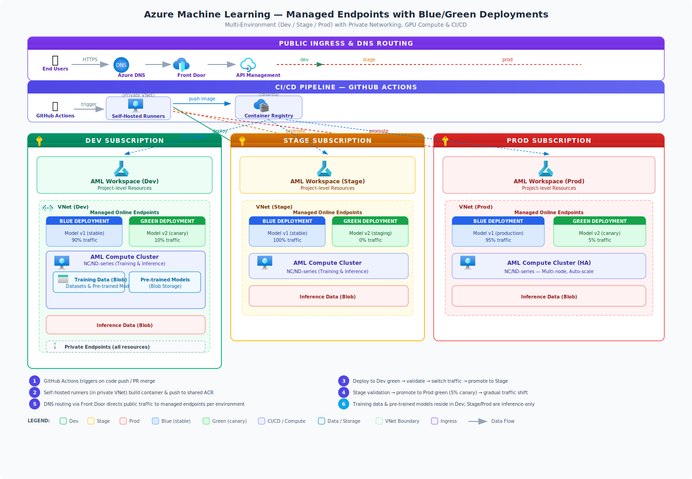
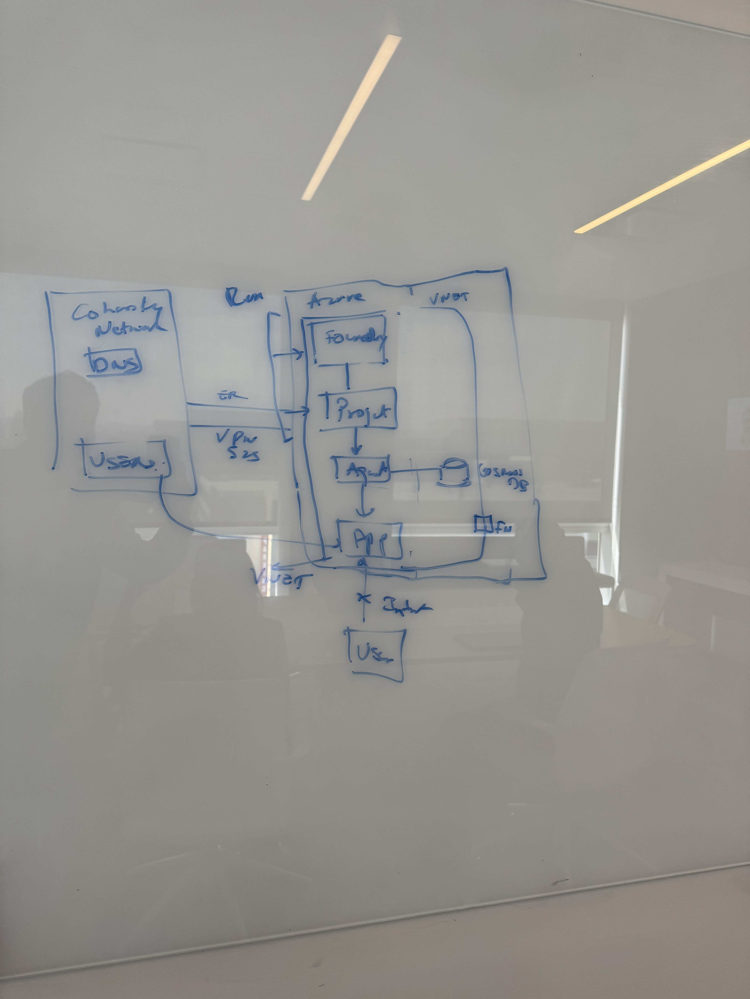
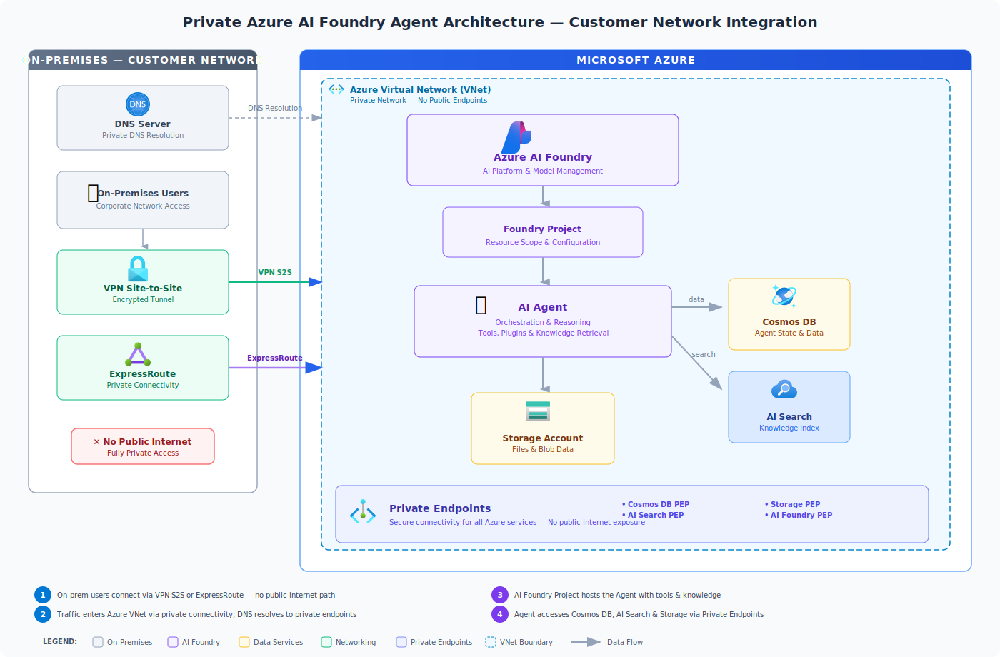

# Azure Architecture Center — SVG Diagram Generator

Create professional Azure architecture diagrams as SVG files using **GitHub Copilot** and official Azure service icons — from a whiteboard photo, a hand-drawn sketch, a screenshot, or plain text instructions.



---

## Quick Start

### 1. Provide Your Architecture

You can start from **any input format**:

| Input | How |
|---|---|
| **Whiteboard photo** | Snap a picture, drag it into the Copilot chat |
| **Hand-drawn sketch** | Photograph or scan your drawing, attach it |
| **Screenshot** | Paste or attach a screenshot of an existing diagram |
| **Text description** | Describe the architecture in plain English |
| **Reference PPTX** | Point to a file in `Reference_Architecture/` |

> Supported image formats: PNG, JPG, JPEG, GIF, WEBP. HEIC files should be converted to JPG/PNG first.

### 2. Select the Agent in GitHub Copilot

1. Open **GitHub Copilot Chat** in VS Code (`Ctrl+Shift+I` or the Copilot sidebar).
2. At the top of the chat, click the **agent/mode selector**.
3. Choose **`azure_architecture_creator_agent`** from the list.
4. Attach your image or type your architecture description and send.

The agent will interpret your input, map components to Azure services, embed official icons, and produce a complete self-contained SVG file.

### 3. Review and Iterate

- The SVG is saved to `Architecture_Diagrams/` by default.
- Open the `.svg` file to preview directly in VS Code or a browser.
- Ask Copilot to make changes: *"move the database to the right"*, *"add a Key Vault"*, *"change the color scheme"*, etc.

---

## How It Works

### Azure Icons

This repo contains **official Azure service icons** in `Azure_Icons/`, organized by category. Each icon is an 18×18 SVG that gets embedded directly into the output diagram — no external image references, no broken links.

The agent automatically:
- Identifies which Azure services your architecture uses
- Locates the correct icon SVG file
- Embeds it inline with uniquely prefixed gradient IDs (to avoid conflicts)
- Scales and positions each icon within its container box

### Skills — Styling, Layout & Customization

All look-and-feel configuration lives in `.github/skills/azure-architecture-svg/SKILL.md`. This is where the agent reads its rules for:

| What | Where in SKILL.md |
|---|---|
| **Icon catalog** | Quick-reference table mapping services → icon file paths |
| **Color scheme** | Semantic color palette (AI = purple, Data = amber, Networking = green, etc.) |
| **Font sizes** | Title = 20, headers = 14, box titles = 12, subtexts = 10 |
| **Layout patterns** | Horizontal layers, vertical columns, hybrid with sidebar |
| **Spacing rules** | Margins, padding, gap sizes between elements |
| **Arrow styles** | Solid for data flow, dashed for logical relationships |
| **Legend format** | Always included, covers all color-coded categories |

**To customize the theme**, edit `SKILL.md` directly:

- **Change colors** — update the color palette table (header gradient, fill, stroke, text columns)
- **Change fonts** — modify the font-family in the SVG skeleton template
- **Change layout** — adjust spacing values, viewBox dimensions, or switch layout patterns
- **Add icons** — drop new SVGs into `Azure_Icons/` and add entries to the quick-reference table

### Reference Architectures

The `Reference_Architecture/` folder contains SVG reference files with proven architecture patterns:

| File | Scenario |
|---|---|
| `agent_architecture.svg` | AI agent system design |
| `maf_orchestrations.svg` | Microsoft Agent Framework orchestrations |
| `mcp_architecture.svg` | Model Context Protocol patterns |
| `handoff-architecture.svg` | Multi-agent handoff patterns |
| `slide3_streaming_architecture.svg` | Streaming data architecture |
| `data_protection_presentation.svg` | Data protection workflows |

The agent consults these when your request matches a known pattern, using them to inform component selection, layout, and data flow.

---

## Example Usage

### Whiteboard to SVG

**1. Input** — a whiteboard photo snapped on a phone:



**2. Prompt:**
```
convert this whiteboard architecture into a nice svg architecture
```

**3. Output** — a professional SVG with official Azure icons, color-coded zones, and a legend:



---

## Example Prompts

```
"Create an architecture for a private AI agent using Azure AI Foundry 
with Cosmos DB and AI Search, connected to on-prem via ExpressRoute"
```

```
"Convert this whiteboard photo into an Azure architecture diagram"
[attach image]
```

```
"Draw a 3-tier web app with App Service, Azure SQL, and Redis Cache 
behind an Application Gateway"
```

```
"Create a data pipeline: Event Hubs → Stream Analytics → Cosmos DB → Power BI"
```

---

## Output Format

Every generated diagram is:

- **Self-contained SVG** — no external dependencies, no JavaScript, no CSS files
- **Renders everywhere** — VS Code, browsers, GitHub markdown, PNG/PDF export
- **Uses official Azure icons** — embedded inline, not referenced externally
- **Includes a legend** — color-coded categories explained at the bottom
- **Valid XML** — all tags closed, attributes quoted, proper namespaces